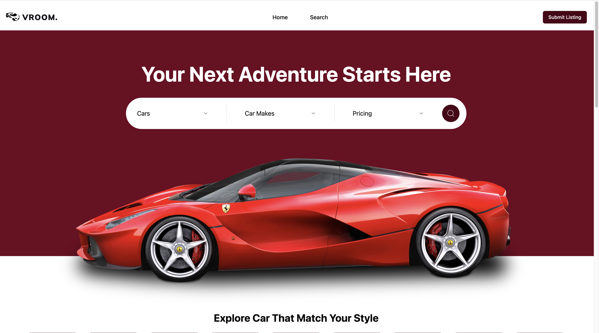
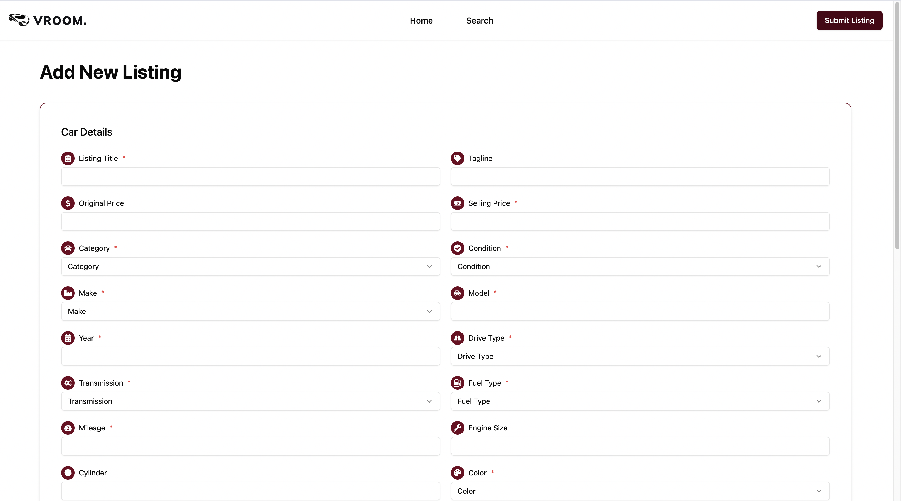
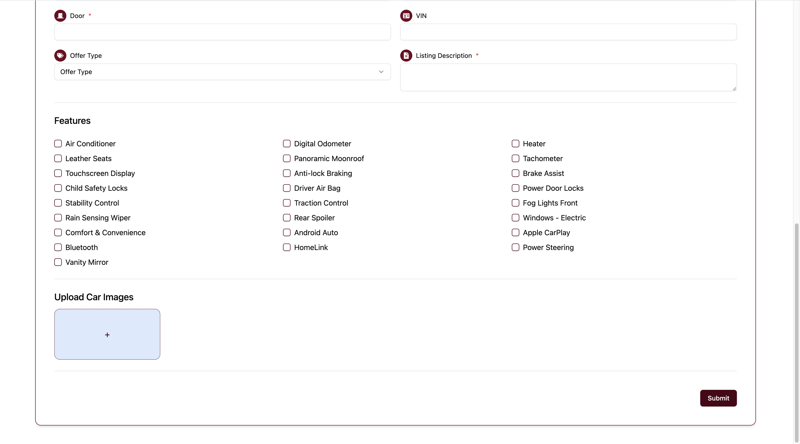
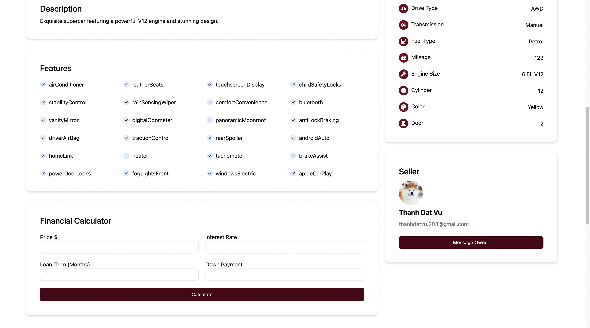
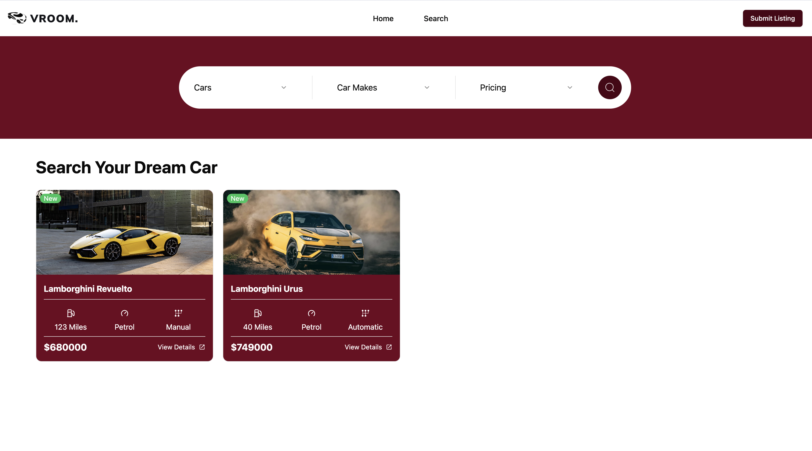
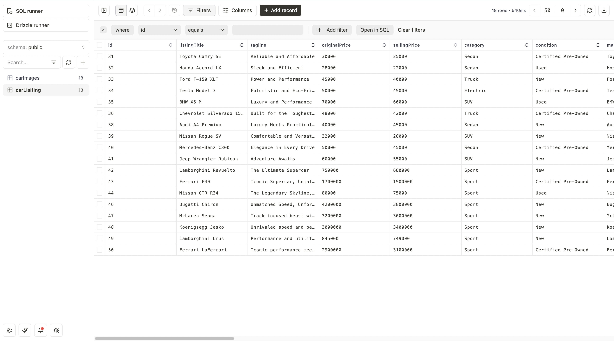
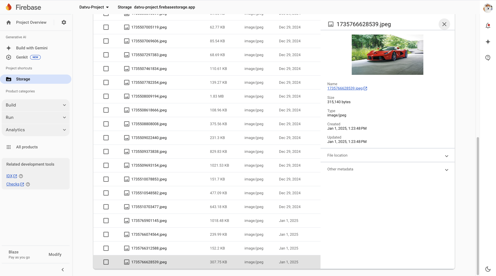

<!-- PROJECT LOGO -->
<br />
<div align="center">
  <a href="https://github.com/othneildrew/Best-README-Template">
    
  </a>
  <p align="center">
    <a href="">View Demo</a>
    ·
    <a href="https://github.com/ThanhDatVu111/Vroom-Vroom/issues">Report Bug</a>
    ·
    <a href="https://github.com/ThanhDatVu111/Vroom-Vroom/pulls">Request Feature</a>
  </p>
</div>

<!-- TABLE OF CONTENTS -->
<details>
  <summary>🗂️ Table of Contents</summary>
  <ol>
    <li><a href="#-about-the-project">About The Project</a>
      <ul>
        <li><a href="#-home-page">Home Page</a></li>
        <li><a href="#-add-listing">Add Listing</a></li>
        <li><a href="#-listing-details">Listing Details</a></li>
        <li><a href="#-search-functionality">Search Functionality</a></li>
        <li><a href="#-user-profile">User Profile</a></li>
        <li><a href="#-database-structure">Database Structure</a></li>
      </ul>
    </li>
    <li><a href="#%EF%B8%8F-tech-stack">Tech Stack</a></li>
    <li><a href="#-getting-started">Getting Started</a>
      <ul>
        <li><a href="#-prerequisites">Prerequisites</a></li>
        <li><a href="#%EF%B8%8F-installation">Installation</a></li>
      </ul>
    </li>
    <li><a href="#-contributing">Contributing</a></li>
    <li><a href="#-license">License</a></li>
    <li><a href="#-contact">Contact</a></li>
  </ol>
</details>

<!-- ABOUT THE PROJECT -->
## 🚀 Home

Vroom is a modern car marketplace platform that connects car buyers and sellers. The platform offers:

- 🔐 Secure authentication with Clerk
- 💬 Real-time chat functionality using Sendbird
- 📸 Car listing management with image uploads
- 🔍 Advanced search and filtering options
- 💫 Smooth user experience with modern UI components
- 📱 Responsive design for all devices


### 🏠 Home Page




The home page features:
- Modern and clean interface
- Featured car listings
- Category navigation
- Quick search functionality


### 📝 Add Listing





The listing creation process includes:
- Multiple image upload
- Detailed car specifications
- Pricing information
- Condition description


### 🚙 Listing Details





Each listing page provides:
- High-resolution image gallery
- Comprehensive vehicle information
- Seller details
- Direct messaging capability
- Lease Calculator
- Show Other Cars Listing


### 🔍 Search Functionality




Advanced search options include:
- Category-based filtering
- Condition, Make, Price range selection


### 👤 Profile


Our user profile system features:
- Show personal listings
- Listing edit + delete
- Message center


### 💾 Database Structure





The application uses:
- Neon Database for structured data
- Firebase for image storage
- Real-time data synchronization
- Efficient data querying
- Secure data management


<p align="right">(<a href="#readme-top">back to top</a>)</p>

## 🛠️ Tech Stack

This project is built using modern technologies to ensure performance and scalability.

### Frontend
[![Vite][Vite.js]][Vite-url]
[![React][React.js]][React-url]
[![React Router][React-router.dom]][React-router-url]
[![Tailwind CSS][Tailwind.css]][Tailwind-url]
[![Radix UI][Radix.ui]][Radix-url]
[![Lucide React][Lucide.react]][Lucide-url]

### Backend & Services
[![Firebase][Firebase.com]][Firebase-url]
[![Drizzle ORM][Drizzle.orm]][Drizzle-url]
[![Sendbird][Sendbird.com]][Sendbird-url]

### Authentication & Database
[![Clerk][Clerk.dev]][Clerk-url]
[![Neon Database][Neon.tech]][Neon-url]
[![Firebase][Firebase.com]][Firebase-url]

### Tooling & Utilities
[![ESLint][ESLint.com]][ESLint-url]
[![Drizzle Kit][Drizzle.kit]][Drizzle-url]
[![Tailwind Merge][Tailwind.merge]][Tailwind-merge-url]
[![shadcn/ui][Shadcn.ui]][Shadcn-url]

<!-- MARKDOWN LINKS & BADGES -->
[Vite.js]: https://img.shields.io/badge/Vite-646CFF?style=for-the-badge&logo=vite&logoColor=white
[Vite-url]: https://vitejs.dev/

[React.js]: https://img.shields.io/badge/React-20232A?style=for-the-badge&logo=react&logoColor=61DAFB
[React-url]: https://reactjs.org/

[React-router.dom]: https://img.shields.io/badge/React_Router-CA4245?style=for-the-badge&logo=react-router&logoColor=white
[React-router-url]: https://reactrouter.com/

[Tailwind.css]: https://img.shields.io/badge/Tailwind_CSS-38B2AC?style=for-the-badge&logo=tailwind-css&logoColor=white
[Tailwind-url]: https://tailwindcss.com/

[Radix.ui]: https://img.shields.io/badge/Radix_UI-161618?style=for-the-badge&logo=radix-ui&logoColor=white
[Radix-url]: https://www.radix-ui.com/

[Lucide.react]: https://img.shields.io/badge/Lucide_React-gray?style=for-the-badge
[Lucide-url]: https://lucide.dev/

[Firebase.com]: https://img.shields.io/badge/Firebase-FFCA28?style=for-the-badge&logo=firebase&logoColor=black
[Firebase-url]: https://firebase.google.com/

[Drizzle.orm]: https://img.shields.io/badge/Drizzle_ORM-C5F74F?style=for-the-badge&logo=drizzle&logoColor=black
[Drizzle-url]: https://orm.drizzle.team/

[Sendbird.com]: https://img.shields.io/badge/Sendbird-FF0000?style=for-the-badge&logo=sendbird&logoColor=white
[Sendbird-url]: https://sendbird.com/

[Clerk.dev]: https://img.shields.io/badge/Clerk-6C47FF?style=for-the-badge&logo=clerk&logoColor=white
[Clerk-url]: https://clerk.com/

[Neon.tech]: https://img.shields.io/badge/Neon-000000?style=for-the-badge&logo=postgresql&logoColor=white
[Neon-url]: https://neon.tech/

[ESLint.com]: https://img.shields.io/badge/ESLint-4B32C3?style=for-the-badge&logo=eslint&logoColor=white
[ESLint-url]: https://eslint.org/

[Drizzle.kit]: https://img.shields.io/badge/Drizzle_Kit-C5F74F?style=for-the-badge&logo=drizzle&logoColor=black
[Drizzle-url]: https://orm.drizzle.team/kit-docs/overview

[Tailwind.merge]: https://img.shields.io/badge/Tailwind_Merge-38B2AC?style=for-the-badge&logo=tailwindcss&logoColor=white
[Tailwind-merge-url]: https://www.npmjs.com/package/tailwind-merge

[Shadcn.ui]: https://img.shields.io/badge/shadcn%2Fui-000000?style=for-the-badge&logo=shadcnui&logoColor=white
[Shadcn-url]: https://ui.shadcn.com/

<p align="right">(<a href="#readme-top">back to top</a>)</p>

<!-- GETTING STARTED -->

## 🚀 Getting Started

This is an example of how you may give instructions on setting up your project locally.
To get a local copy up and running follow these simple example steps.

### 📋 Prerequisites

...download vite

### Installation

_Below is an example of how you can instruct your audience on installing and setting up your app. This template doesn't rely on any external dependencies or services._

1. Get a free API Key at [https://example.com](https://example.com)
2. Clone the repo
   ```sh
   git clone https://github.com/github_username/ai-course-generator.git
   ```
3. Install NPM packages
   ```sh
   npm install
   ```
4. Set up your key

   ```js
    VITE_CLERK_PUBLISHABLE_KEY=
    VITE_DRIZZLE_DATABASE_URL=
    VITE_FIREBASE_API_KEY=
    VITE_SENDBIRD_APP_ID=
    VITE_SENDBIRD_API_TOKEN=
   ```

5. Change git remote url to avoid accidental pushes to base project

   ```sh
    git remote set-url origin https://github.com/github_username/your-repo-name.git
    git remote -v # confirm the changes
   ```

6. Start the development server
   npm run dev

<p align="right">(<a href="#readme-top">back to top</a>)</p>

<!-- USAGE EXAMPLES -->
<!-- CONTRIBUTING -->

## 🤝 Contributing

Contributions are what make the open source community such an amazing place to learn, inspire, and create. Any contributions you make are **greatly appreciated**.

If you have a suggestion that would make this better, please fork the repo and create a pull request. You can also simply open an issue with the tag "enhancement".
Don't forget to give the project a star! Thanks again!

1. Fork the Project
2. Create your Feature Branch (`git checkout -b feature-name`)
3. Commit your Changes (`git commit -m 'Add some feature'`)
4. Push to the Branch (`git push origin feature-name`)
5. Open a Pull Request

<!-- LICENSE -->

## 📜 License

Distributed under the MIT License. See `LICENSE.txt` for more information.

<p align="right">(<a href="#readme-top">back to top</a>)</p>

<!-- CONTACT -->

## 📧 Contact

Thanh Dat Vu - [LinkedIn](https://www.linkedin.com/in/thanhdatvu111) - thanhdatvu.203@gmail.com

Project Link: [https://github.com/ThanhDatVu111/Vroom-Vroom](https://github.com/ThanhDatVu111/Vroom-Vroom)

<p align="right">(<a href="#readme-top">back to top</a>)</p>